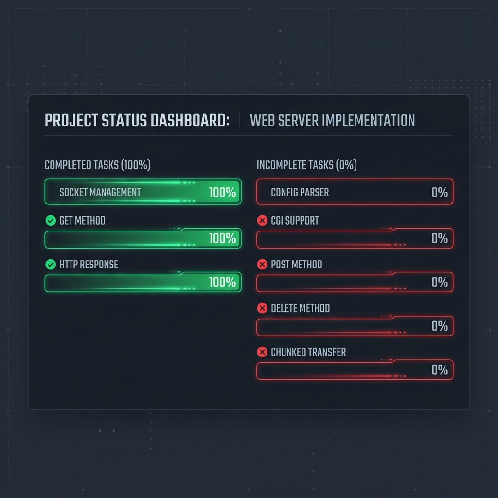
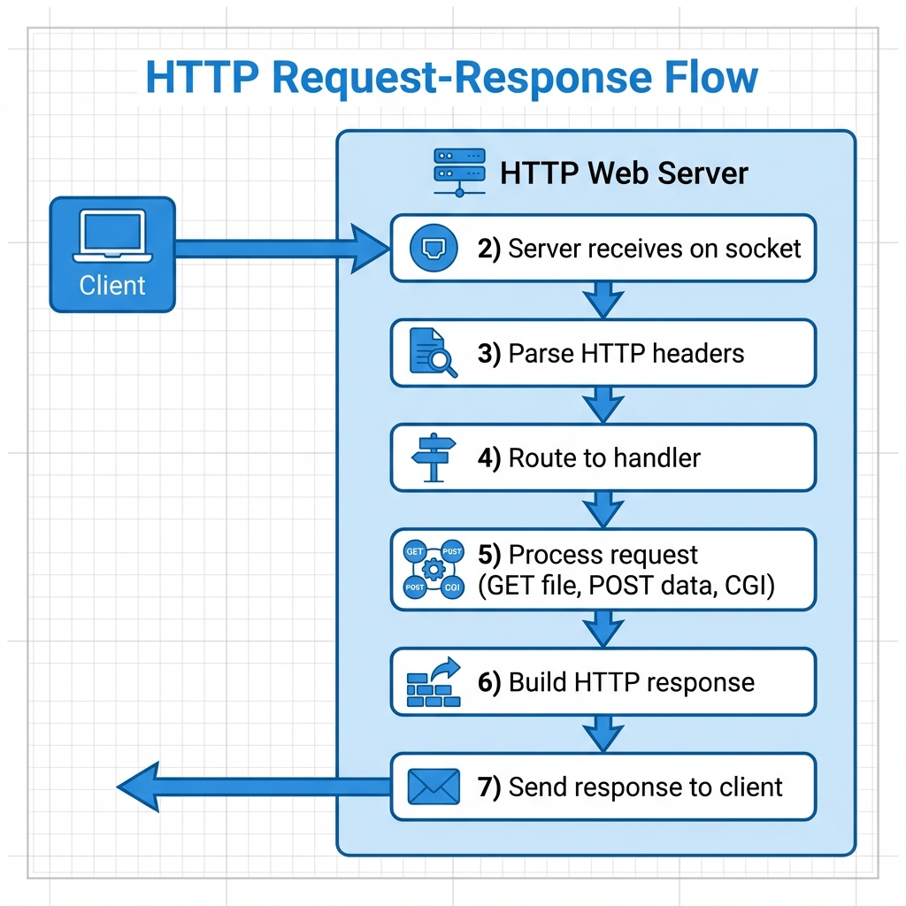
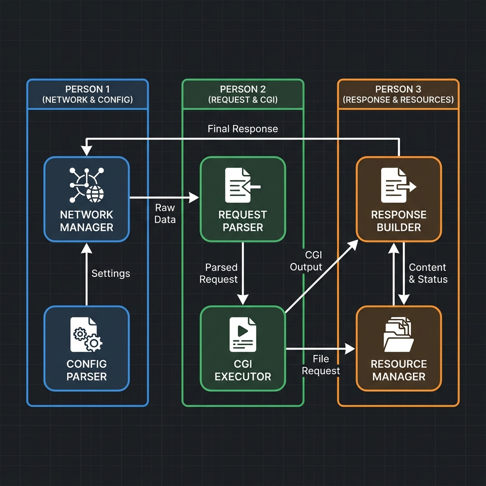

# 42 Webserver Projesi - Kapsamlı Dokümantasyon

> **Proje:** HTTP Sunucu | **Dil:** C++98 | **Ekip:** 3 Kişi  
> **Tarih:** 2026-01-18 | **Tamamlanma:** ~25-30%

---

## 📊 Proje İlerleme Durumu



---

## 🔄 Sunucu Çalışma Mantığı



### Adım Adım Açıklama:

1. **Client HTTP isteği gönderir** → `GET /index.html HTTP/1.1`
2. **Socket'ten veri alınır** → `recv()` fonksiyonu ile
3. **HTTP header parse edilir** → `\r\n\r\n` aranır
4. **İstek yönlendirilir** → GET, POST veya CGI'a
5. **İşlem yapılır** → Dosya okunur veya script çalıştırılır
6. **HTTP response oluşturulur** → Status + Headers + Body
7. **Client'a gönderilir** → `send()` fonksiyonu ile

---

## 👥 Ekip Yapısı ve Görev Dağılımı



### 👤 Kişi 1: Network Manager + Config Parser (MAVİ)

| Görev | Durum | Zorluk |
|-------|-------|--------|
| Socket yönetimi | ✅ Tamamlandı | Orta |
| Non-blocking I/O | ✅ Tamamlandı | Orta |
| **Config Parser** | ❌ Yapılacak | **Zor** |
| **Multiple Servers** | ❌ Yapılacak | Orta |
| **poll() migration** | ❌ Yapılacak | Kolay |

**Oluşturulacak dosyalar:**
- `inc/Config.h`
- `inc/Location.h`
- `src/ConfigParser.cpp`

---

### 👤 Kişi 2: Request Parser + CGI Executor (YEŞİL)

| Görev | Durum | Zorluk |
|-------|-------|--------|
| Basit GET parsing | ✅ Tamamlandı | Kolay |
| **Header parsing** | ❌ Yapılacak | Orta |
| **Chunked encoding** | ❌ Yapılacak | **Zor** |
| **CGI desteği** | ❌ Yapılacak | **Çok Zor** |

**Oluşturulacak dosyalar:**
- `inc/Request.h`
- `src/RequestParser.cpp`
- `src/CGI.cpp`

---

### 👤 Kişi 3: Response Builder + Resource Manager (TURUNCU)

| Görev | Durum | Zorluk |
|-------|-------|--------|
| GET response | ✅ Tamamlandı | Kolay |
| **POST metodu** | ❌ Yapılacak | Orta |
| **DELETE metodu** | ❌ Yapılacak | Kolay |
| **Autoindex** | ❌ Yapılacak | Orta |
| **Custom error pages** | ❌ Yapılacak | Kolay |

**Oluşturulacak dosyalar:**
- `inc/Response.h`
- `src/ResponseBuilder.cpp`
- `src/Autoindex.cpp`

---

## 📁 Mevcut Proje Yapısı

```
webserver/
├── inc/                    # Header dosyaları
│   ├── Client.h           # Client struct (27 satır)
│   ├── Server.h           # Server class (46 satır)
│   └── webserv.h          # Fonksiyon prototipleri (30 satır)
├── src/                    # Kaynak dosyalar
│   ├── main.cpp           # Giriş noktası (20 satır)
│   ├── Server.cpp         # Network yönetimi (218 satır) ⭐
│   ├── Document.cpp       # Request/Response (84 satır)
│   └── Utils.cpp          # Yardımcı fonksiyonlar (59 satır)
├── www/                    # Web root
│   └── index.html         # Test sayfası
├── docs/                   # Bu dokümantasyon
├── Makefile               # Derleme
└── README.md              # Proje açıklaması
```

**Toplam:** ~381 satır kod

---

## 🚀 Hızlı Başlangıç

### Derleme
```bash
cd ~/webserver
make
```

### Çalıştırma
```bash
./webserv 8080 ./www
```

### Test
```bash
# Tarayıcıda
http://localhost:8080

# Terminal ile
curl -v http://localhost:8080
curl http://localhost:8080/index.html
```

---

## 💻 Kod Analizi

### Server.cpp - Ana Bileşenler

```cpp
// 1. Socket kurulumu
int fd = socket(AF_INET, SOCK_STREAM, proto);
bind(fd, (struct sockaddr*)&addr, sizeof(addr));
listen(fd, 128);

// 2. Ana döngü (select ile multiplexing)
while (running) {
    select(maxfd + 1, &rfds, &wfds, 0, 0);
    accept_new_clients();     // Yeni bağlantılar
    handle_client_io(...);    // Okuma/yazma
}

// 3. Request işleme
recv(fd, buf, sizeof(buf), 0);
process_request(request, docroot, response);
send(fd, outbuf.data(), outbuf.size(), 0);
```

### Document.cpp - İstek İşleme

```cpp
void process_request(const string& req, ...) {
    // 1. Request line parse: "GET /path HTTP/1.1"
    iss >> method >> target >> version;
    
    // 2. Sadece GET destekleniyor (şimdilik)
    if (method != "GET") return error(405);
    
    // 3. Path güvenlik kontrolü
    sanitize_path(target, clean);
    
    // 4. Dosyayı oku ve response oluştur
    build_file_response(docroot, clean, response);
}
```

---

## ⚠️ Kritik Gereksinimler

> **C++98 ZORUNLU** - auto, range-for, nullptr, lambda kullanılamaz!

> **NON-BLOCKING I/O** - Tüm socket işlemleri non-blocking olmalı

> **POLL/SELECT** - fork() her istek için yapılamaz, multiplexing şart

> **MEMORY LEAK YOK** - valgrind --leak-check=full ile test edilecek

---

## 📅 Önerilen Zaman Planı

| Hafta | Kişi 1 | Kişi 2 | Kişi 3 |
|-------|--------|--------|--------|
| 1 | Config Parser | Request Parser | POST metodu |
| 2 | Config Parser (devam) | Chunked Encoding | DELETE metodu |
| 3 | Multiple Servers | CGI başlangıç | Autoindex |
| 4 | poll() migration | CGI tamamlama | Error pages |
| 5 | **Entegrasyon ve Test** |||

---

## 🔗 Kaynaklar

- [HTTP/1.1 Spesifikasyonu (RFC 2616)](https://www.rfc-editor.org/rfc/rfc2616)
- [CGI Spesifikasyonu (RFC 3875)](https://www.rfc-editor.org/rfc/rfc3875)
- [42 Subject PDF](https://github.com/42-subjects)

---

**📧 İletişim:** 42 Slack kanalı üzerinden koordinasyon  
**📁 Repo:** `git@github.com:sudaban/42-webserv.git`
